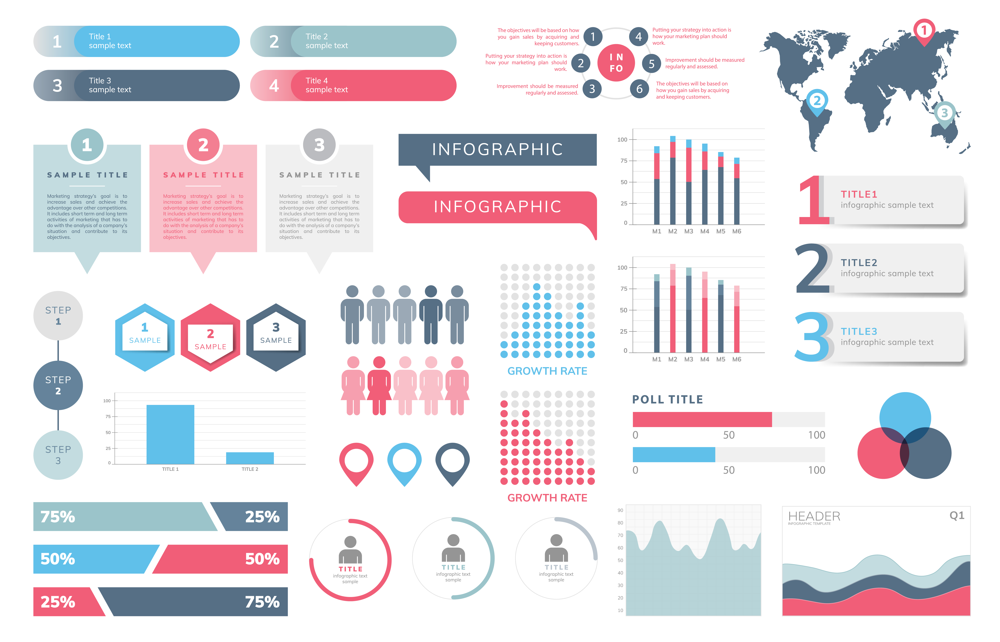

# Estudando estatística básica com Python

A estatística envolve técnicas para coletar, organizar, descrever, analisar e interpretar dados provenientes de experimentos ou vindos de outros estudos observacionais.

Neste projeto, utilizaremos a linguagem de programação Python para realizar análises estatísticas e explorar dados.

O Python é uma linguagem de programação poderosa e flexível que fornece uma ampla gama de bibliotecas e ferramentas para análise de dados. Algumas das principais bibliotecas utilizadas neste projeto incluem NumPy, pandas, Matplotlib, Seaborn, SciPy e StatsModels. Com essas bibliotecas, você poderá manipular e analisar grandes conjuntos de dados, visualizar resultados e fazer previsões.

  

Este [projeto](https://github.com/joaomarcelofc/Estatistica_Basica_Python/blob/main/Estudando_estatistica_basica_Python.ipynb) inclui exemplos de código e demonstrações de como realizar análises estatísticas básicas com o Python. Além disso, fornecemos uma descrição detalhada dos dados e dos métodos utilizados, para que você possa entender e replicar as análises realizadas.

Se você é um iniciante em Python ou em análise de dados, este projeto será uma ótima oportunidade para você aprender e praticar suas habilidades. Se você já é experiente nestas áreas, esperamos que encontre neste projeto ideias e insights para aplicar em seus próprios projetos.

Bom trabalho e divirta-se explorando os dados!
